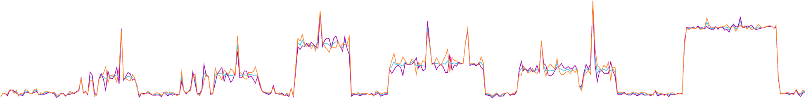
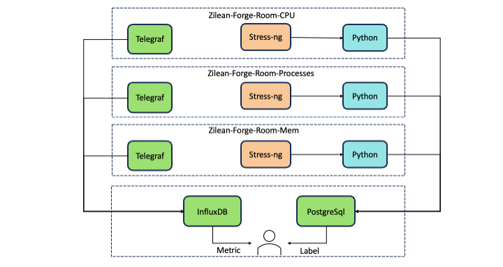
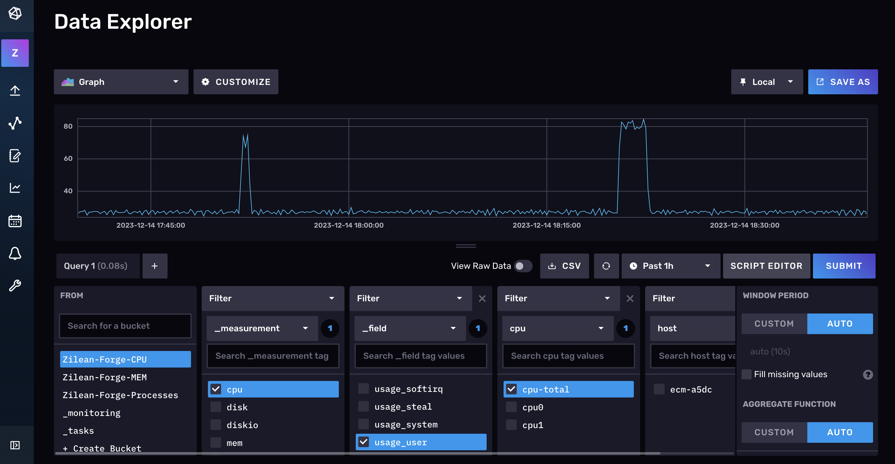
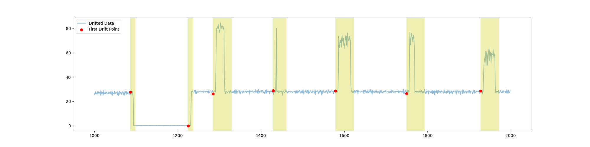
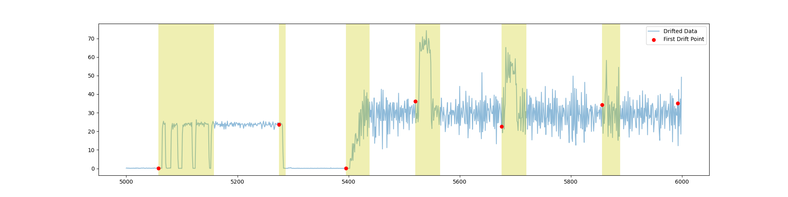
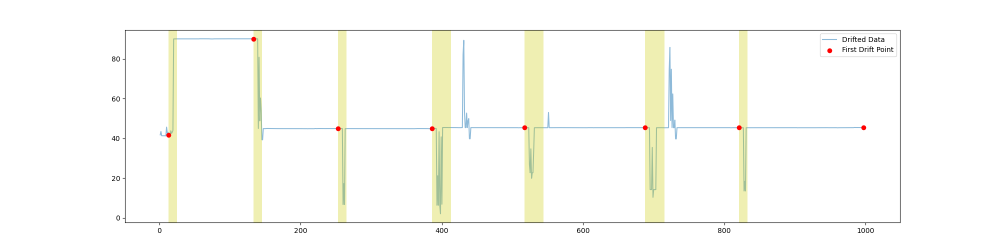
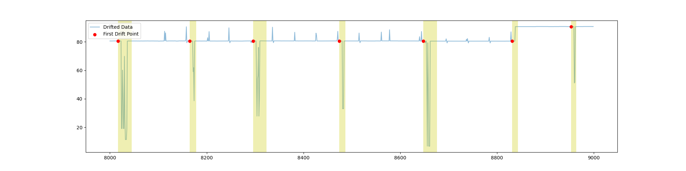
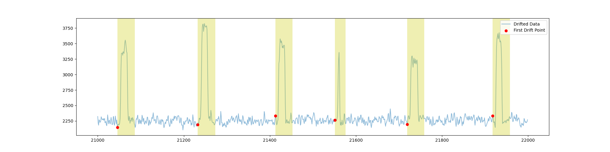
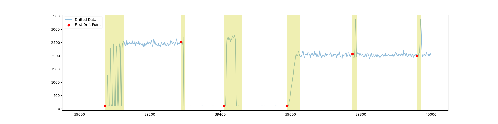

# Tiny-Zilean-Forge
[English|[Chinese](docs/pic/README.md)]

Zilean-Forge is a platform for concept drift generation of time series data.
At present, the core principle is to use the stress-ng tool to generate commands for stress testing Linux servers, and use pyhton to create a scheduler to reasonably schedule these commands so that different conceptual drift types can be formed on the server's system indicators, including: Burst, incremental, gradual, etc.
These system indicator data are collected through the Telegraf tool and persisted in InfluxDB. At the same time, the scheduler created through python will persist its drift labels in PostgreSql.
This warehouse provides a Tiny version that users can quickly build and use without much technical background knowledge. It can help algorithm researchers and engineers quickly obtain high-quality drift test data sets and carry out robust timing concept drift type analysis models. verification and optimization work. The following picture is the effect of collected CPU data:



# Architecture


Zilean-Forge is a platform for concept drift generation of time series data.
At present, the core principle is to use the stress-ng tool to generate commands for stress testing Linux servers, and use pyhton to create a scheduler to reasonably schedule these commands so that different conceptual drift types can be formed on the server's system indicators, including: Burst, incremental, gradual, etc.
These system indicator data are collected through the Telegraf tool and persisted in InfluxDB. At the same time, the scheduler created through python will persist its drift labels in PostgreSql.
This warehouse provides a Tiny version that users can quickly build and use without much technical background knowledge. It can help algorithm researchers and engineers quickly obtain high-quality drift test data sets and carry out robust timing concept drift type analysis models. verification and optimization work. The following picture is the effect of collected CPU data:


- Data collection machine: CPU 2 core 2G; system version is as follows：
    ```bash
    PRETTY_NAME="Debian GNU/Linux 10 (buster)"
    NAME="Debian GNU/Linux"
    VERSION_ID="10"
    VERSION="10 (buster)"
    VERSION_CODENAME=buster
    ID=debian
    ```

- Data storage machine: DB host depends on the size of the data you collect (recommended: CPU 4 cores 8G); the system version is as follows
    ```bash
    PRETTY_NAME="Debian GNU/Linux 10 (buster)"
    NAME="Debian GNU/Linux"
    VERSION_ID="10"
    VERSION="10 (buster)"
    VERSION_CODENAME=buster
    ID=debian
    ```
- InfluxDB version
  ```bash
  InfluxDB v2.4.0 (git: de247bab08)
  ```
  
- Telegraf version
  ```bash
  Telegraf 1.23.4 (git: HEAD 5b48f5da)
  ```
  
- python version
  ```bash
  python 3.8.0
  ```

- postgresql
  ```bash
  9.6.15
  ```
- stress-ng version
  ```text
  stress-ng: version 0.09.50
  ```
  
# Drift generation logic
In order to generate various concept drifts, Zilean-Forge uses stress-ng, a stress testing tool, to create different forms of load on the server.
Currently, the platform currently provides simulation of CPU and memory. Zilean-Forge calls stress-ng through a python script and controls a series of scheduling logic such as its start, stop, combination and superposition, etc.
This results in different types of drift such as graduated/incremental (progressive), sudden (burst), recurrent (periodic), etc.
For example, progressive drift can be produced by gradually increasing CPU pressure; burst drift can be produced by pausing pressure and then suddenly resuming; and periodic drift can be produced by periodically switching between different pressure modes.
The size, duration, combination and scheduling of pressure can all be controlled programmatically through python scripts.

# File description
```text
├── config
│   ├── cpu_config.yaml
│   ├── generator_config.yaml
│   ├── mem_config.yaml
│   ├── processes_config.yaml
│   └── scheduler_config.yaml
├── core
│   ├── cpu
│   │   └── cmd_factory.py
│   ├── generator.py
│   ├── mem
│   │   └── cmd_factory.py
│   ├── processes
│   │   └── cmd_factory.py
│   ├── scheduler.py
│   └── toolkit
│       ├── logger.py
│       └── tools.py
├── data
├── logs
├── storage
├── tests
│   ├── cmd_factory_test.py
│   ├── scheduler_test.py
│   └── tools_test.py
└── utils
    ├── processed
    ├── procession.py
├── main.py
├── mem_shell.sh
├── cpu_shell.sh
├── processes_shell.sh
├── requirements.txt

```
The config module mainly provides different types and some parameters of the generator and scheduler;
The core module is the core module of this project, including the generation of commands and the scheduling of related commands;
data is mainly used to save data;
Logs saves some necessary output information during the running process to help us locate errors and adjust parameters;
Strorage mainly saves the corresponding drift label information to facilitate the subsequent production of annotation data sets;
tests provides tests for the core module;
The utils module mainly provides the conversion of collected data into standard data;
main.py is the project entry point, but it is not recommended to run it directly;
*_shell.sh, these three scripts correspond to simulating different indicators.

# Deploy
Once the paper is accepted, the full deployment details document will be available for download
- Cluster construction
- Deploy influxDB and telegraf
  - Deploy python program
    - Pull code
      ```bash
      git clone 
      cd Tiny-Zilean-Forge
      ```
    - Create a program execution environment
      ```bash
      pip install -r requirements.txt
      ```
    - Download data through influxDB Web UI Data collection
    


# Collection data display
The part covered by the yellow area is the generated drift segment
- Zilean-Forge-Room-CPU --->  cpu ---> usage_user ---> cpu-total
<figure class="half">
    
    
</figure>


- Zilean-Forge-Room-MEM --->  mem ---> available
<figure class="half">
    
    
</figure>


- Zilean-Forge-Room-Processes ---> processes ---> total
<figure class="half">
    
    
</figure>


# Version planning

The current Tiny-Zilean-Forge is the initial version of Zilean-Forge. In the future, more factors will be added to it, hoping that the simulation will be more realistic.

-[ ] based on containerization

-[ ] Multidimensional indicators

-[ ] Based on event driven drift rather than simulation

-[ ] ....


# Disclaimer

This project "Zilean-Forge" aims to provide users with a convenient time series concept drift data generation platform to help test and optimize the robustness of time series analysis algorithms.
This software is provided "as is" and the development team makes no warranties of any kind, express or implied, including but not limited to warranties of merchantability, fitness for a particular purpose, or non-infringement.
Under no circumstances will the development team be liable for any direct or indirect losses. Users are responsible for all risks of use, and the development team does not assume any responsibility for performance or any loss or damage caused by the use or inability to use this software (including but not limited to loss of business profits, business interruption, loss of information, etc.).
Any data generated is for testing research only and should not be relied upon for business analysis. Users should verify the quality of the data and the effectiveness of the algorithm by themselves, and the development team is not responsible for any losses caused by quality problems. The right to interpret this disclaimer belongs to the software development team.
If you have any questions, please feel free to contact the development team.