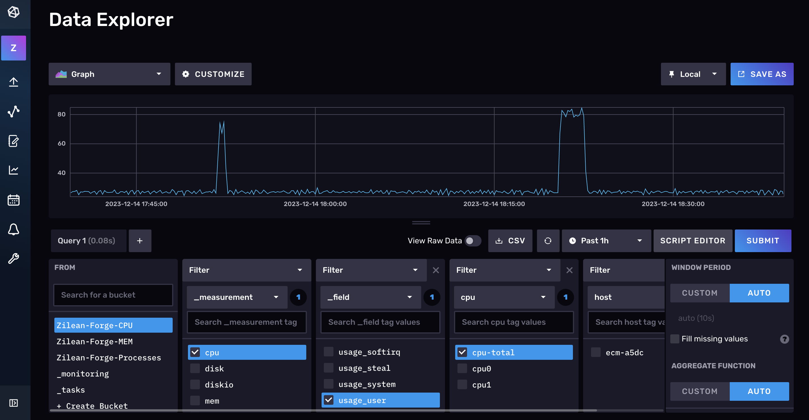
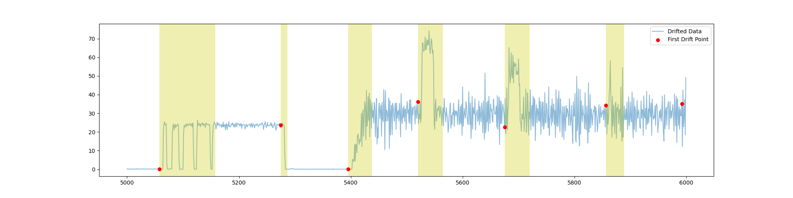
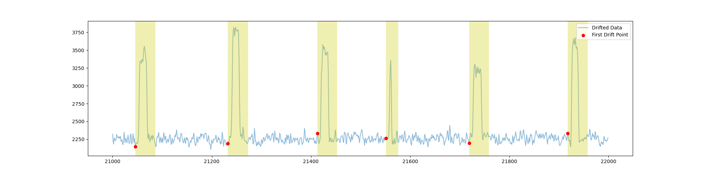
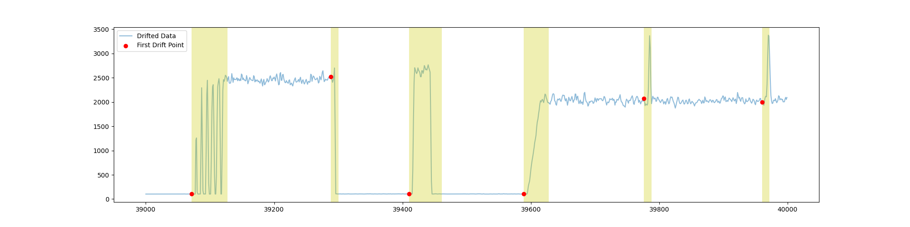

# Tiny-Zilean-Forge
Zilean-Forge是一个面向时间序列数据概念漂移生成的平台。
目前来说，其核心原理是利用stress-ng工具来生成压测Linux服务器的命令，使用pyhton创建调度器来合理调度这些命令使得能够在服务器的系统指标上形成不同的概念漂移类型，包括：包括突发式、递增式、渐进式等。
这些系统指标数据是通过Telegraf工具采集的，并持久化在了InfluxDB当中，同时通过python创建的调度器会将其漂移标签持久化在PostgreSql中。
本仓库提供的是一个Tiny版本，用户无需太多技术背景知识就可以快速搭建和使用，可以帮助算法研究人员和工程师快速获得高质量的漂移测试数据集,开展时序概念漂移类型分析模型的鲁棒性验证与优化工作。下图是采集的CPU数据效果：


# Architecture

Tiny-Zilean-Forge包含4台主机，其中一台作为数据保存机器，其余作为采集数据机器。
作为独立版本，非常不推荐将数据存储在采集系统指标数据的机器上。指标采集的机器可以根据需要自由伸缩。详细的机器信息如下：

- 数据采集机器：CPU 2核2G；系统版本如下
  ```bash
  PRETTY_NAME="Debian GNU/Linux 10 (buster)"
  NAME="Debian GNU/Linux"
  VERSION_ID="10"
  VERSION="10 (buster)"
  VERSION_CODENAME=buster
  ID=debian
  ```

- 数据存储机器：DB主机取决你采集的数据规模（推荐：CPU 4核8G）；系统版本如下
  ```bash
  PRETTY_NAME="Debian GNU/Linux 10 (buster)"
  NAME="Debian GNU/Linux"
  VERSION_ID="10"
  VERSION="10 (buster)"
  VERSION_CODENAME=buster
  ID=debian
  ```

- influxDB版本
  ```bash
  InfluxDB v2.4.0 (git: de247bab08)
  ```

- Telegraf版本
  ```bash
  Telegraf 1.23.4 (git: HEAD 5b48f5da)
  ```

  


# 漂移产生逻辑

为了产生各类概念漂移,Zilean-Forge通过stress-ng这个压力测试工具,来对服务器进行不同形式的负载制造。
目前，该平台目前提供了CPU、内存的模拟。Zilean-Forge通过python脚本调用stress-ng,以及控制其启动、停止、组合叠加等一系列调度逻辑,
从而产生 graduated/incremental(渐进式)、sudden(突发式)、recurrent(周期性)等不同类型的漂移。
例如,可以通过逐步增加CPU压力的方式产生渐进漂移;通过暂停压力然后突然恢复来产生突发漂移;通过周期性地切换不同的压力模式来产生周期性漂移。
压力的大小、持续时间、组合和调度方式都可以通过python脚本进行编程控制。

# 从该平台获取到不同概念漂移类型
本文对不同的概念漂移类型进行了说明，事实上，很多文献已经对它们进行了大量的详细研究。为了更好地帮助理解，下面给出了该平台上的一些不同类型的漂移、 
很明显，相同类型的漂移在形状上存在一些差异、 而不同类型的漂移之间又有一些相似之处，这些将成为主要的分类难题。
- Sudden
<div style="display: flex;">
    
    
    
</div>

- Blip
<div style="display: flex;">
    
    
    
</div>

- Recurrent
<div style="display: flex;">
    
    
    
</div>

- Incremental
<div style="display: flex;">
    
    
    
</div>

- Gradual
<div style="display: flex;">
    
    
    
</div>


# 文件说明

```bash
├── config
│   ├── cpu_config.yaml
│   ├── generator_config.yaml
│   ├── mem_config.yaml
│   ├── processes_config.yaml
│   └── scheduler_config.yaml
├── core
│   ├── cpu
│   │   └── cmd_factory.py
│   ├── generator.py
│   ├── mem
│   │   └── cmd_factory.py
│   ├── processes
│   │   └── cmd_factory.py
│   ├── scheduler.py
│   └── toolkit
│       ├── logger.py
│       └── tools.py
├── data
├── logs
├── storage
├── tests
│   ├── cmd_factory_test.py
│   ├── scheduler_test.py
│   └── tools_test.py
└── utils
    ├── processed
    ├── procession.py
├── main.py
├── mem_shell.sh
├── cpu_shell.sh
├── processes_shell.sh
├── requirements.txt

```

config模块下主要提供了不同类型以及生成器、调度器的一些参数；core模块是本项目的核心模块，包括命令的生成以及相关命令的调度；data主要用于保存数据；logs则保存了运行过程中必要的一些输出信息帮助我们定位错误和调整参数；strorage则主要是保存对应的漂移的标签信息方便后续制作标注数据集；tests针对core模块提供了测试；utils模块主要是提供将采集数据转换为标准数据；main.py为项目入口，但是不推荐直接运行；*_shell.sh，这三个脚本对应模拟不同的指标


# 部署

- 集群搭建
- 部署influxDB和telegraf
- 部署python程序
  - 拉取代码
  ```bash
  git clone 
  cd
  ```
  - 创建程序运行环境
  ```bash
  pip install -r requirements.txt
  ```
  - 运行对应脚本
  ```bash
  nohup ./mem_shell.sh
  ```
- 通过influxDB Web UI下载数据数据采集


论文接受后，完整部署细节文档将可以下载


# 采集数据展示
- Zilean-Forge-Room-CPU --->  cpu ---> usage_user ---> cpu-total
<figure class="half">
    
    
</figure>


- Zilean-Forge-Room-MEM --->  mem ---> available
<figure class="half">
    
    
</figure>


- Zilean-Forge-Room-Processes ---> processes ---> total
<figure class="half">
    
    
</figure>


# 版本规划

目前的Tiny-Zilean-Forge作为Zilean-Forge初始版本，未来会有更多的一些因素被加入其中，希望能够模拟更加贴合现实情况

- [ ] 基于容器化

- [ ] 多维指标

- [ ] 基于事件驱动漂移而不是模拟

- [ ] ....

请继续关注我们的工作或者你感觉我们工作可以联系d_zhao_work@163.com加入我们的工作！


# FAQ

以下是一些关于本项目的常见问题解答


# 免责声明

本项目“Zilean-Forge”旨在为用户提供一个便捷的时间序列概念漂移数据生成平台,以帮助测试和优化时间序列分析算法的鲁棒性。
本软件按“现状”提供,开发团队不作任何明示或暗示的保证,包括但不限于对适销性、特定目的适用性或不侵权的保证。
在任何情况下,开发团队不对任何直接或间接的损失承担责任。用户需自行承担使用全部风险,开发团队不对性能或因使用或无法使用本软件而导致的任何损失或损害承担任何责任(包括但不限于业务利润损失、业务中断、信息丢失等)。
所生成的任何数据仅用于测试研究,不应作为业务分析的依据。用户应自行验证数据的质量和算法的效果,开发团队不承担任何质量问题导致的损失。本免责声明的解释权归软件开发团队所有。
如有任何疑问,欢迎联系开发团队。
